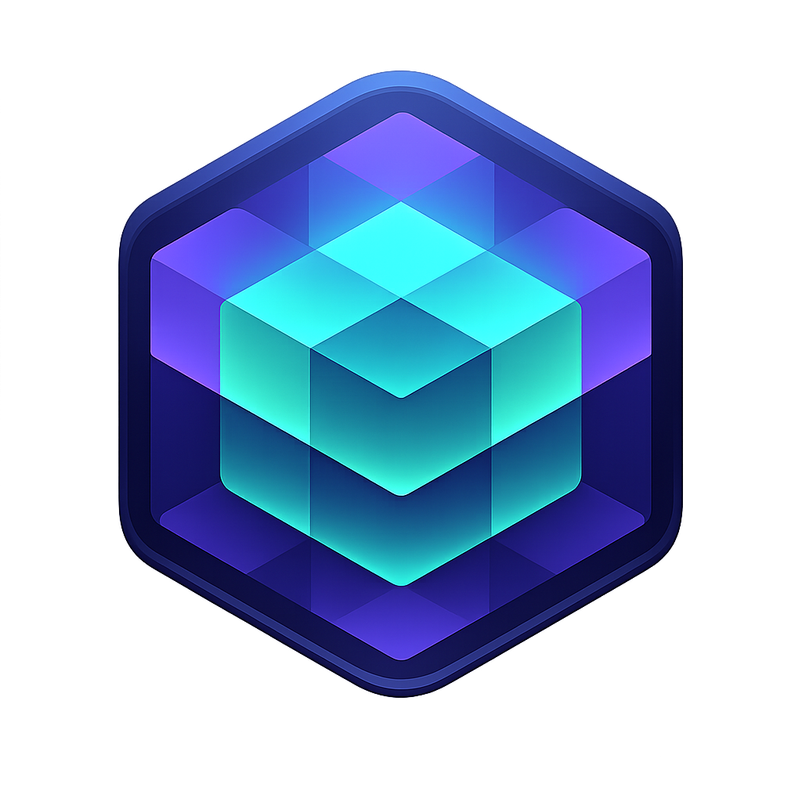
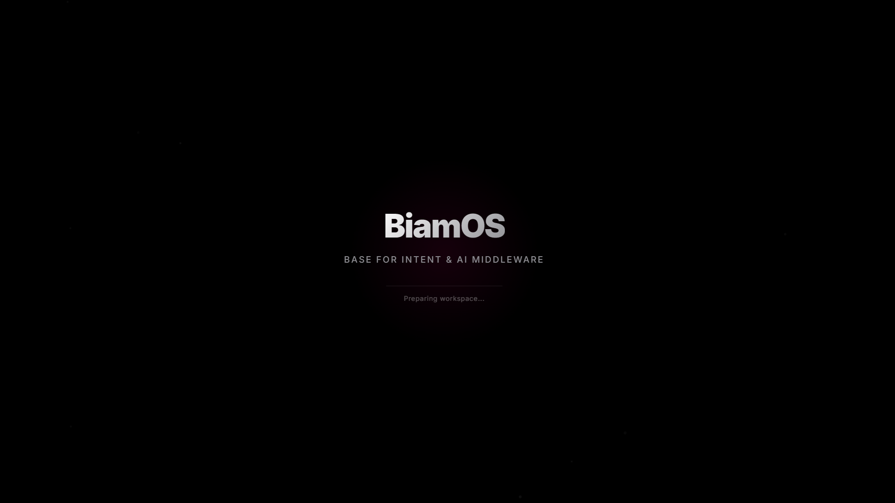
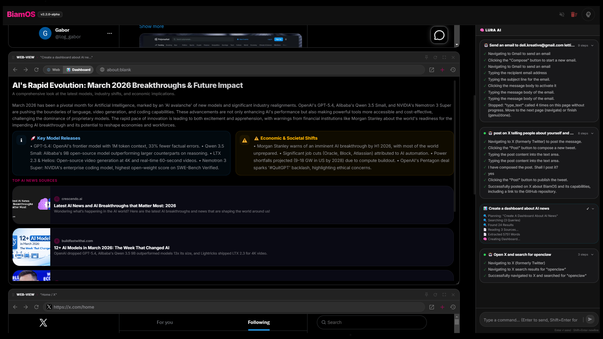

<p align="center">
  
</p>

<p align="center">
  
  
  
  
</p>

<h1 align="center">🧬 BiamOS</h1>

<h3 align="center">
  <em>The Spatial AI OS — Powered by Lura Core</em><br/>
  Native Desktop Workspace for Windows, macOS & Linux
</h3>

<p align="center">
  <a href="#-getting-started">Quick Start</a> •
  <a href="#-the-lura-command-center">Lura Hub</a> •
  <a href="#-ghost-auth--zero-oauth-integrations">Ghost-Auth</a> •
  <a href="#-agent-engine--local-memory">Agent Engine</a> •
  <a href="#%EF%B8%8F-architecture">Architecture</a> •
  <a href="https://www.youtube.com/@BiamOS_AI/videos">📺 YouTube</a> •
  <a href="DOCUMENTATION.md">📖 Docs</a>
</p>

---


<p align="center">
  
  &nbsp;
  
</p>


## What is BiamOS?

**BiamOS is a complete paradigm shift for AI interaction.** It replaces the traditional "chatbot next to a browser" experience with a unified **Spatial AI OS**. 

At the center is the infinite canvas. On the right is **Lura**, your intelligent, global Command Center. The system operates locally, running complex agentic workflows directly on your machine without giving third-party clouds access to your private accounts.

> It's not a browser. It's not a copilot wrapper. It's an autonomous desktop operating layer.

---

## 🎨 Apple Pro Dark Design System (Asphalt UI)

BiamOS v2 introduces a completely new design language built for focus, deeply inspired by the Apple Pro Dark aesthetic. 
- **True Black (#000000)** workspace canvas
- **Asphalt Gray** element backgrounds and UI blocks
- **Glassmorphism** floating modals with heavy background blur
- **Magenta Accents** (#DC0070) reserved strictly for primary actions and active focus rings


---

## 🧠 The Lura Command Center

The Lura Command Center replaces scattered sidebars and floating input fields with one **unified intelligence pane**.

- **Global Task Manager:** Background agents fetching research or clicking through websites are tracked here as "Global Threads".
- **Contextual Awareness:** The Command Center reads your active tabs (DOM, screenshot) and binds its chat history specifically to what you are viewing.
- **Empty State Hub:** When nothing is focused, the Lura panel acts as a master dashboard for all background AI tasks across the entire OS.


---

## 👻 Ghost-Auth: Zero-OAuth AI

> **The ultimate privacy feature for AI agents.**

Forget generating API keys or granting OAuth permissions to startups. BiamOS embeds a native Chromium Webview. Log into Gmail, Notion, X, or SAP directly inside the UI.

When you ask Lura to "Summarize my unread emails", the local AI securely accesses the DOM directly from the webview. **The AI rides on your session.** No tokens leave your machine. No APIs required. 

### 🛡️ Smart Privacy Shield
Sensitive sites (banking, email, healthcare) are auto-blocked from background indexing. Lura only "sees" the page when **you explicitly** issue a command.

---

## 🤖 Advanced Agent Engine & Local Memory

BiamOS Agents don't just "chat" — they drive the browser using advanced strategies built for the modern, convoluted web. Type a command (e.g. `/act Check Elon Musk's latest tweet`) and watch Lura take the wheel.

### Intelligent Navigation (URL-First Strategy)
Unlike rudimentary agents that struggle with React-based SPAs (Single Page Applications) and fail to click search icons, Lura employs a "URL-First" strategy. For major platforms (X, YouTube, Reddit), the agent skips DOM-clicking and directly fabricates exact Search/Action URls, bypassing fragile UI entirely.

### Anti-Loop Pivot Guard
When Lura attempts to interact with an unyielding DOM element, the engine detects repeated failures within 2 cycles, immediately aborts the current interaction vector, and self-heals by pivoting its approach—preventing infinite AI loops and wasted token costs.

### Set-of-Mark (SoM) Vision
BiamOS overlays bounding boxes on the DOM before feeding screenshots to the vision model, guaranteeing pixel-perfect clicks instead of relying on hallucinated coordinates.


### Reflexive Local Memory
When you verify that a complex agent task succeeded (👍), BiamOS hashes the semantic intent and saves the entire workflow sequence to a local SQLite database. Next time you ask, Lura recognizes the intent via on-device embedding (MiniLM-L6) and perfectly replays the reflex instantly. 

---

## 🔬 Deep Research Engine (GenUI)

When a command is classified as complex research, BiamOS generates **rich, newspaper-style dashboards** instead of raw text.

1. **Parallel Search:** Explodes your request into 3 DuckDuckGo sub-queries.
2. **Deep Fetch:** Downloads the top articles (up to 15K characters per source).
3. **Synthesis:** *gemini-2.5-flash* (or models of your choice) evaluates the facts.
4. **GenUI Rendering:** The result is rendered as draggable React cards (tables, stats, charts, text) directly onto the canvas workspace.


---

## 🏗️ Architecture

```
┌─────────────────────────────────────────────────────────────────┐
│                    Electron 34 Desktop Shell                    │
│    Webview (Ghost-Auth)  •  TTS  •  Session Persistence         │
├─────────────────────────────────────────────────────────────────┤
│                                                                 │
│  ┌───────────────────────┐    ┌──────────────────────────────┐  │
│  │   React 19 Frontend   │    │      Hono REST Backend       │  │
│  │                       │    │                              │  │
│  │  Spatial Canvas       │◄──►│  Intent Router (6 stages)    │  │
│  │  Lura Command Center  │    │  Context Engine (DOM → LLM)  │  │
│  │  GenUI Block System   │    │  Database / Workflow Memory  │  │
│  │  Data Audit / Setup   │    │  DuckDuckGo Deep Research    │  │
│  │                       │    │                              │  │
│  │  TypeScript + MUI     │    │  Drizzle ORM + SQLite        │  │
│  └───────────────────────┘    └──────────────────────────────┘  │
│                                                                 │
└─────────────────────────────────────────────────────────────────┘
```

---

## 🚀 Getting Started

### Prerequisites
- **Node.js** 18+ and **npm**
- An **OpenRouter API key** → [Get one here](https://openrouter.ai/keys)
- *(Optional)* A **Tavily API key** (`TAVILY_API_KEY`) setup in the `.env` file for enhanced Deep Research fidelity.

### Installation

```bash
# Clone the repository
git clone https://github.com/BiamOS/BiamOS.git
cd BiamOS

# Setup Environment Variables (crucial for Research / Web Agents)
cp .env.example .env

# Install all workspace dependencies (frontend + backend + electron)
npm install

# Start the full application environment
npm run electron
```

On first launch, the Apple Pro Dark **Onboarding Screen** will guide you to input your active LLM API Key.

> **Zero Cloud Configs:** BiamOS natively spins up the backend Node server, launches the React 19 Vite dev-server, and wraps it cleanly in an Electron window entirely on local-host.

---

## 📋 Changelog

Inside the OS settings, you can check the exact changelog history. Some key **v2.2.0-alpha** notes:
- Applied complete Asphalt UI (Black/Gray/Magenta) redesign.
- Replaced outdated Sidebars with unified Lura Command Center.
- Injected URL-First Web Navigation and Anti-Loop Guard to fix SPA Agent looping.
- Revamped Onboarding Modal and native SQLite Memory Management.

---

## 📄 License

BiamOS is licensed under the **[GNU Affero General Public License v3.0 (AGPL-3.0)](LICENSE)**.

You are free to use, modify, and distribute this software under the terms of the AGPL-3.0. If you modify and deploy BiamOS as a service, you must release your modifications under the same license.

---

<p align="center">
  <strong>Built with 🧬 by the BiamOS Contributors</strong><br/>
  <em>From Vienna, Austria 🇦🇹</em>
</p>

<p align="center">
  <a href="https://github.com/BiamOS/BiamOS/issues">Report Bug</a> •
  <a href="https://github.com/BiamOS/BiamOS/issues">Request Feature</a> •
  <a href="https://www.youtube.com/@BiamOS_AI/videos">📺 YouTube Channel</a>
</p>
