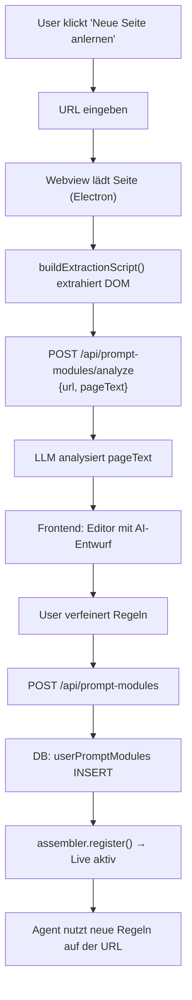

# Prompt Library — Concept & Architecture Plan

> **Phase 3: App Store für Prompts — User-erstellte Plattform-Module**

## Problem

Neue Plattform-Regeln (z.B. für GitHub, LinkedIn, Reddit) erfordern derzeit einen Code-Commit in `prompt-modules/platform-*.ts`. Kein User kann eigene Regeln hinzufügen, ohne den Quellcode zu ändern.

## Vision

Users können direkt im Settings-UI neue Seiten "anlernen". BiamOS analysiert eine URL automatisch via LLM und generiert Navigation-Regeln als Entwurf. Der User verfeinert diesen im Editor und speichert ihn. Der `PromptAssembler` lädt ab sofort Module aus **Dateisystem + Datenbank**.

---

## 1. Bestandsaufnahme: Vorhandene Bausteine (100% Reuse)

| Bestehendes Bauteil | Wo | Reuse für Prompt Library |
|---|---|---|
| `SettingsShell.tsx` | 8-Panel Sidebar | Neues 9. Panel `"prompts"` hinzufügen |
| `MemoryManager.tsx` | CRUD-Liste mit Stats, Expand/Collapse, Delete-Dialog | **Blueprint copyen**: `PromptLibrary.tsx` — gleiche Struktur, andere Daten |
| `SharedUI.tsx` | `panelSx`, `gradientTitleSx`, `StatCard`, `EmptyState`, `DangerButton`, `LoadingSpinner`, `scrollbarSx` | Alle direkt importierbar |
| `IntegrationStore.tsx` | Shop/My Tabs, Search+Filter Chips | Tab-Pattern + Search recyclen für "Built-in / Custom" Tabs |
| `IntegrationBuilder.tsx` | Multi-Step Wizard mit URL-Eingabe → AI-Analyse → Editor | **Kernpattern** für "Neue Seite anlernen" Flow |
| Drizzle ORM (`schema/*.ts`) | SQLite-Schemas mit `sqliteTable()` | Neues Schema `prompt-modules.schema.ts` |
| `/api/agents/memory` | REST CRUD (GET/POST/PATCH/DELETE) | Blueprint für `/api/prompt-modules` API |
| `PromptModule` Interface (`types.ts`) | `id`, `name`, `priority`, `match`, `rules`, `tools?` | DB-Module müssen dieses Interface erfüllen |

> [!TIP]
> Der `MemoryManager.tsx` ist der engste Cousin — gleiche Grund-UI (List mit Stats-Row, expandierbare Rows, CRUD-Actions). Wir kopieren die Grundstruktur und passen sie an.

---

## 2. Datenbank-Architektur

### Neues Schema: `prompt-modules.schema.ts`

```typescript
// packages/backend/src/db/schema/prompt-modules.schema.ts
import { sqliteTable, text, integer } from "drizzle-orm/sqlite-core";

export const userPromptModules = sqliteTable("user_prompt_modules", {
    id: integer("id").primaryKey({ autoIncrement: true }),

    /** Unique module ID, e.g. "user-github" */
    module_id: text("module_id").notNull().unique(),

    /** Display name, e.g. "GitHub" */
    name: text("name").notNull(),

    /** Sort priority (50 = platform default) */
    priority: integer("priority").notNull().default(50),

    /** URL match patterns as JSON array of strings
     *  e.g. ["github\\.com", "gist\\.github\\.com"]
     *  Stored as regex strings, compiled at runtime */
    url_patterns: text("url_patterns").notNull(),  // JSON string[]

    /** Task match patterns (optional) as JSON array */
    task_patterns: text("task_patterns"),  // JSON string[] | null

    /** Phase filter as JSON array, e.g. ["action", "research"] */
    phases: text("phases"),  // JSON PromptPhase[] | null

    /** The actual prompt rules text */
    rules: text("rules").notNull(),

    /** Is this module currently active? */
    is_active: integer("is_active", { mode: "boolean" }).notNull().default(true),

    /** Source: "ai_generated" | "manual" | "imported" */
    source: text("source").notNull().default("manual"),

    /** Original URL that was analyzed (for re-analysis) */
    source_url: text("source_url"),

    created_at: text("created_at").notNull(),
    updated_at: text("updated_at").notNull(),
});

export type UserPromptModule = typeof userPromptModules.$inferSelect;
export type NewUserPromptModule = typeof userPromptModules.$inferInsert;
```

### Registrierung in `schema.ts` (Barrel)

```diff
+ export { userPromptModules } from "./schema/prompt-modules.schema.js";
+ export type { UserPromptModule, NewUserPromptModule } from "./schema/prompt-modules.schema.js";
```

---

## 3. Backend-API: `/api/prompt-modules`

### CRUD Endpoints

| Method | Route | Beschreibung |
|--------|-------|-----------|
| `GET` | `/api/prompt-modules` | Alle Module laden (Built-in + Custom) |
| `POST` | `/api/prompt-modules` | Neues User-Modul speichern |
| `PATCH` | `/api/prompt-modules/:id` | Modul updaten (rules, active, name) |
| `DELETE` | `/api/prompt-modules/:id` | User-Modul löschen |
| `POST` | `/api/prompt-modules/analyze` | **AI-Assistent**: URL → DOM → LLM → Regel-Entwurf |

### AI-Analyse Endpoint (`POST /analyze`)

> [!CAUTION]
> **SPA-Problem:** Ein simpler `fetch()` im Node.js-Backend zieht nur rohes HTML.
> Bei modernen SPAs (GitHub, Twitter, LinkedIn) ist das HTML leer bis JavaScript
> ausgeführt wurde. **Die DOM-Extraktion MUSS über den Electron-Webview laufen.**

#### Korrekter Flow: Frontend-first DOM Extraction

```
Flow (Frontend → Backend):
1. Frontend: User gibt URL ein (z.B. "https://github.com")
2. Frontend: Unsichtbarer Webview lädt die Seite → wartet auf Render
3. Frontend: buildExtractionScript() extrahiert gerenderten DOM-Text
   (Datei: extractPageContent.ts — 240 Zeilen, bereits production-ready)
4. Frontend: Sendet { url, pageText } an POST /api/prompt-modules/analyze
5. Backend: LLM analysiert den pageText + generiert Regel-Entwurf
6. Backend: Gibt { name, url_patterns, rules_draft, priority } zurück
7. Frontend: Editor zeigt Entwurf → User verfeinert → Speichert
```

#### Warum das funktioniert (bestehende Infrastruktur)

Der `buildExtractionScript()` in `extractPageContent.ts` ist ein **ausgereifter** 
DOM-Extraktor mit:
- 🔍 SPA-Erkennung (Loading-Spinner/Skeleton-Detection)
- 🎯 Site-spezifische Extractors (YouTube, Twitter/X)
- 🧹 Aggressivem Noise-Filtering (Ads, Nav, Cookie-Banner)
- 📊 Strukturiertem Text mit Deduplication

Bereits genutzt in: `IframeBlock.tsx`, `useContextWatcher.ts`, `useContextChat.ts`.

#### Analyse-Prompt (System)

```
You are a web automation expert. Analyze this page content from {url} and generate
navigation rules for an AI browser agent.

Page content:
{pageText}

Output JSON:
{
  "name": "GitHub",
  "url_patterns": ["github\\.com"],
  "suggested_rules": "PLATFORM: GitHub\n- Repository navigation: ...\n- Issue creation: ...\n- Search: Use the search bar at the top..."
}

Focus on: navigation patterns, search flows, form submissions, common actions.
Keep rules concise (max 10 bullet points).
```

---

## 4. PromptAssembler: Hybrid Loading (Dateisystem + DB)

### Aktueller Code (`prompt-assembler.ts`)

```typescript
// Derzeit: nur statische Module
assembler.registerAll([baseModule, phaseResearchModule, ...]);
```

### Upgrade: `loadUserModules()`

```typescript
// Neue Funktion im Assembler
async function loadUserModules(): Promise<void> {
    const { db } = await import("../db/db.js");
    const { userPromptModules } = await import("../db/schema.js");
    const { eq } = await import("drizzle-orm");

    const rows = await db.select()
        .from(userPromptModules)
        .where(eq(userPromptModules.is_active, true));

    for (const row of rows) {
        const urlPatterns = JSON.parse(row.url_patterns) as string[];
        const phases = row.phases ? JSON.parse(row.phases) : undefined;
        const taskPatterns = row.task_patterns ? JSON.parse(row.task_patterns) : undefined;

        const module: PromptModule = {
            id: row.module_id,
            name: row.name,
            priority: row.priority,
            match: {
                urls: urlPatterns.map(p => new RegExp(p, "i")),
                phases: phases,
                taskPatterns: taskPatterns?.map((p: string) => new RegExp(p, "i")),
            },
            rules: row.rules,
        };

        assembler.register(module);
    }

    log.debug(`  📚 Loaded ${rows.length} user prompt modules from DB`);
}
```

### Aufruf-Zeitpunkt

```typescript
// In server.ts (App-Start) — nach statischer Registrierung
await loadUserModules();

// Optional: Live-Reload nach Speichern im UI
// POST /api/prompt-modules → nach DB-Write → assembler.register(newModule)
```

> [!IMPORTANT]
> User-Module haben die **gleiche Priorität (50)** wie Built-in Platform-Module. Bei ID-Kollision gewinnt das **zuletzt registrierte** (= User-Modul überschreibt Built-in). Das ist erwünscht: Users können Built-in-Plattformen anpassen.

---

## 5. Frontend: UI-Konzept

### Settings-Panel: "Prompts" Tab

```
┌──────────────────────────────────────────────┐
│ 📝 Prompt Library                            │
│ Manage agent navigation rules per platform   │
├──────────────────────────────────────────────┤
│ [📦 Built-in (17)] [✨ Custom (3)]  [+ Add] │
├──────────────────────────────────────────────┤
│ Stats Row:                                   │
│ [📋 Total: 20] [✅ Active: 18] [🌐 URLs: 15]│
├──────────────────────────────────────────────┤
│ ▸ 🌐 github.com          ✅ Active  P:50    │
│   "Repository navigation, Issues, PRs..."    │
│   [Edit] [⏸ Disable] [🗑 Delete]            │
│                                              │
│ ▸ 📘 linkedin.com        ✅ Active  P:50    │
│   "Profile views, messaging, job search..."  │
│   [Edit] [⏸ Disable] [🗑 Delete]            │
│                                              │
│ ▾ 🐦 x.com (Twitter)     🔒 Built-in        │
│   ┌─────────────────────────────────────┐    │
│   │ PLATFORM: X.com (Twitter)           │    │
│   │ - Search flow: Use the search bar...│    │
│   │ - Profile timeline: Sorted NEWEST...│    │
│   └─────────────────────────────────────┘    │
└──────────────────────────────────────────────┘
```

### "Neue Seite anlernen" Flow (Modal/Wizard)

```
Step 1: URL eingeben    →  [https://github.com        ] [🔍 Analyze]
Step 2: AI generiert    →  ⏳ Analyzing page structure...
Step 3: Editor          →  Textarea mit generierten Regeln
                           User passt an, ändert Name/Priority
Step 4: Speichern       →  [💾 Save Module]
```

### Reuse-Map

| Neues UI-Element | Recycled von |
|---|---|
| `PromptLibrary.tsx` (Hauptkomponente) | `MemoryManager.tsx` — Struktur kopieren |
| Stats Row | `StatCard` aus `SharedUI.tsx` |
| Modul-Liste | `WorkflowRow` Pattern aus `MemoryManager.tsx` |
| Expand → Regel-Preview | `Collapse` + `Typography` (monospace) |
| "Neue Seite anlernen" Dialog | `IntegrationBuilder.tsx` Wizard Pattern |
| Regel-Editor | `<textarea>` mit monospace, ähnlich wie `IntegrationBuilder` Code-Editor |
| Tab-Toggle | `Chip` Tabs aus `IntegrationStore.tsx` |

---

## 6. Zusammenfassung & Nächste Schritte



### Implementierungs-Reihenfolge

| # | Schritt | Aufwand |
|---|---------|---------|
| 1 | DB Schema + Migration | ~30 min |
| 2 | Backend API (CRUD + `/analyze`) | ~1h |
| 3 | `PromptAssembler.loadUserModules()` | ~20 min |
| 4 | Frontend `PromptLibrary.tsx` | ~1.5h |
| 5 | Settings-Shell Panel + Routing | ~10 min |
| 6 | Testing & Polish | ~30 min |

> [!NOTE]
> **Gesamtaufwand: ~4 Stunden.** Durch massives UI-Recycling (MemoryManager-Struktur, SharedUI-Komponenten, IntegrationBuilder-Pattern) müssen wir im Frontend fast nichts von Null bauen.
